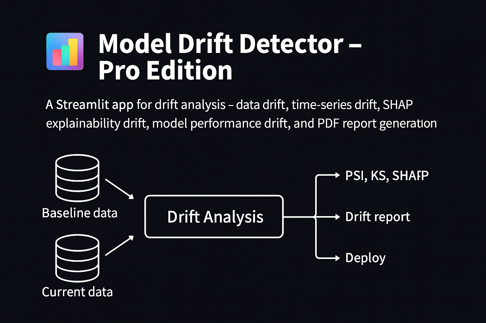
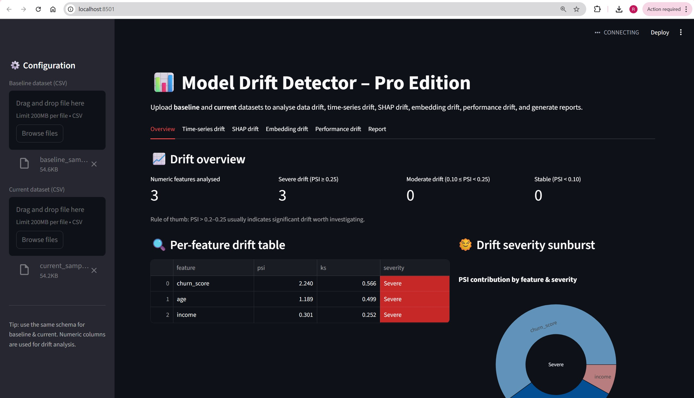

📊 Model Drift Detector — Pro Edition
---
A complete, modular MLOps drift analytics dashboard for monitoring data drift, SHAP drift, embedding drift, performance drift, and more.
Built with Streamlit, Python, SHAP, and Plotly.

Features

1. Feature Drift (PSI + KS)

Detect population shifts between baseline and current datasets

PSI-based severity classification

Histogram comparison

Sunburst visualization

2. Time-Series Drift

Drift trends when a datetime column exists

Aggregation by day/week/month

3. SHAP Explainability Drift

Compare feature importance drift

Supports classification & regression

Highlight unstable model behaviour

4. Embedding Drift (LLMOps)

Cosine similarity drift for text fields

Detect semantic changes

5. Model Performance Drift

Accuracy, AUC, regression errors

Compare baseline vs current predictions

6. Auto PDF Report

One-click report summarizing top drifted features

Architecture
```
model-drift-detector/
│
├── app/
│   ├── main_v3.py
│   ├── drift_metrics.py
│   ├── time_drift/
│   ├── time_shap/
│   ├── embeddings/
│   ├── performance/
│   ├── reporting/
│   └── utils.py
│
├── data_samples/
└── requirements.txt
```

Each drift type lives in its own folder for modularity and extension.

Sreenshots





📦 Installation
git clone <repo-url>
cd model-drift-detector
python3 -m venv .venv
source .venv/bin/activate
pip install -r requirements.txt
streamlit run app/main_v3.py

🧪 Sample Data

Synthetic baseline + current churn datasets included under data_samples/.

📄 License

Open-source — feel free to use, modify, and contribute.
